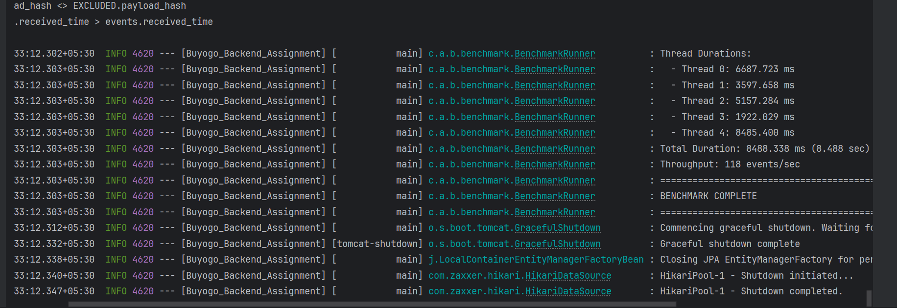
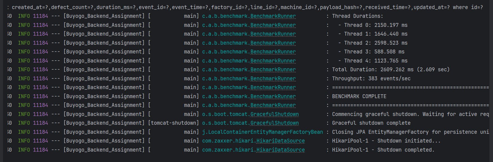
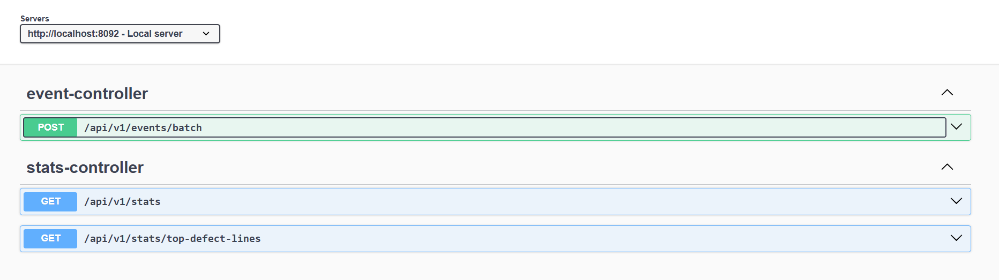
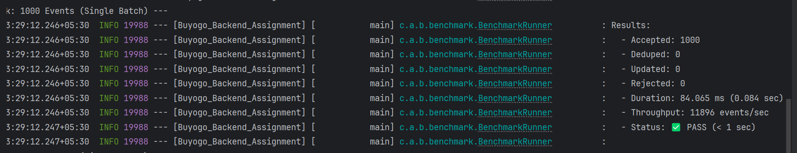
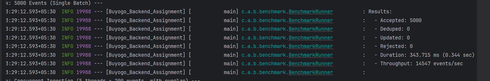
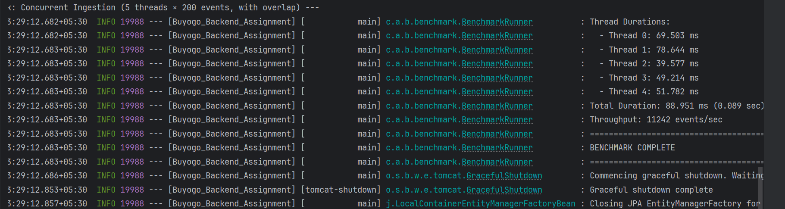

# Factory Machine Events Backend (Buyogo Assignment)

A production-grade Spring Boot backend for ingesting factory machine events at high throughput, supporting **deduplication**, **conditional update**, and **analytics APIs** using PostgreSQL.

This project is optimized to meet the assignment performance requirement:
✅ **1000 events ingestion < 1 second**

---

## ⚡ Performance Highlights

- **Benchmark target**: 1000 events < 1 second ✅ PASSED
- **High-throughput ingestion** using JDBC batch UPSERT
- **Thread-safe ingestion** via PostgreSQL atomic `ON CONFLICT`
- **Fast payload comparison** via SHA-256 `payloadHash`
- Swagger/OpenAPI enabled

---

## Table of Contents
- [Architecture](#architecture)
- [Data Model](#data-model)
- [Deduplication & Update Logic](#deduplication--update-logic)
- [Thread Safety](#thread-safety)
- [Performance Strategy](#performance-strategy)
- [API Endpoints](#api-endpoints)
- [Swagger UI](#swagger-ui)
- [Setup & Run](#setup--run)
- [Benchmark](#benchmark)
- [Tests](#tests)

---

## Architecture

Layered Spring Boot architecture:

```
Client/Sensor
    |
    v
REST Controllers
(EventController, StatsController)
    |
    v
Service Layer
(validation + hashing + dedupe/update)
    |
    v
Repository Layer
EventRepository (JPA queries)
EventBulkRepository (JdbcTemplate batch upsert)
    |
    v
PostgreSQL
```

### Why this architecture?
- Controllers handle request/response only
- Business rules stay inside Service layer
- DB access isolated in repositories
- Enables independent optimization of ingestion vs analytics queries

---

## Data Model

### Event Entity (core)
Stores the latest record per `eventId`.

Important fields:
- `eventId` (unique identifier, used for dedupe/update)
- `eventTime` (event occurrence time, used for time-window queries)
- `receivedTime` (set by backend for ordering & conflict resolution)
- `machineId`
- `durationMs`
- `defectCount`
- `factoryId`, `lineId`
- `payloadHash` (SHA-256 of event payload)

---

## Deduplication & Update Logic

### Payload comparison using hash
To compare payloads efficiently, the service computes:

`payloadHash = SHA-256(payload fields...)`

If two events have the same `payloadHash`, they are treated as identical payloads.

### Rules (core requirement)

For an incoming event with `eventId`:

1) **New eventId**  
   → Insert → **accepted**

2) **Same eventId + same payloadHash**  
   → Ignore → **deduped**

3) **Same eventId + different payloadHash**  
   → Update ONLY if this event has **newer receivedTime**  
   → else ignore (stale update) → **deduped**

### “Winning record”
Backend assigns `receivedTime = Instant.now()`.  
This ensures deterministic ordering (avoids client clock skew).

---

## Thread Safety

Concurrency correctness is guaranteed at DB level using PostgreSQL atomic UPSERT:

```sql
INSERT INTO events(...)
VALUES(...)
ON CONFLICT (event_id)
DO UPDATE SET ...
WHERE
  events.payload_hash <> EXCLUDED.payload_hash
  AND EXCLUDED.received_time > events.received_time;
This ensures:

no duplicate inserts under race conditions

consistent latest-write-wins behavior

no app-level locks required

## Performance Strategy

### Problem with naive approach
Per-event SELECT + INSERT/UPDATE causes too many DB round trips.



### Optimizations implemented
✅ Prefetch existing events

Collect incoming eventIds

Fetch existing records using WHERE event_id IN (...)

✅ JDBC batch UPSERT

Uses JdbcTemplate.batchUpdate(...)

Minimizes DB round trips significantly



## API Endpoints
1) Batch Ingestion
POST /api/v1/events/batch

Response:

accepted

deduped

updated

rejected

rejections[]

2) Machine Stats
GET /api/v1/stats?machineId=...&start=...&end=...

Note: defectCount = -1 is ignored during defect aggregation as required.

3) Top Defect Lines
GET /api/v1/stats/top-defect-lines?factoryId=...&start=...&end=...&limit=...

## Swagger UI

Swagger UI is enabled at:

http://localhost:8092/swagger-ui/index.html



## Setup & Run
Prerequisites
Java 17

Docker + Docker Compose

Run PostgreSQL
```bash
docker compose up -d
```
Run application
```bash
./mvnw spring-boot:run
```
App runs at:
http://localhost:8092

---

## Benchmark

Run benchmark mode:

```bash
./mvnw spring-boot:run -Dspring-boot.run.arguments="--benchmark"
```

Benchmark run environment:

CPU: i5-1240P

RAM: 8 GB

OS: Windows 64-bit

DB: PostgreSQL (Docker)

Latest Results (best run)

✅ 1000 events: 84.065 ms (0.084 sec), 11896 events/sec
✅ 5000 events: 343.715 ms (0.344 sec), 14547 events/sec
✅ Concurrent (5×200 overlap): 88.951 ms (0.089 sec), 11242 events/sec

See full details: BENCHMARK.md

## Benchmark Screenshots







---

## Tests

Integration tests using PostgreSQL/Testcontainers are planned to cover:

validation cases

dedupe/update correctness

query correctness

concurrency safety
